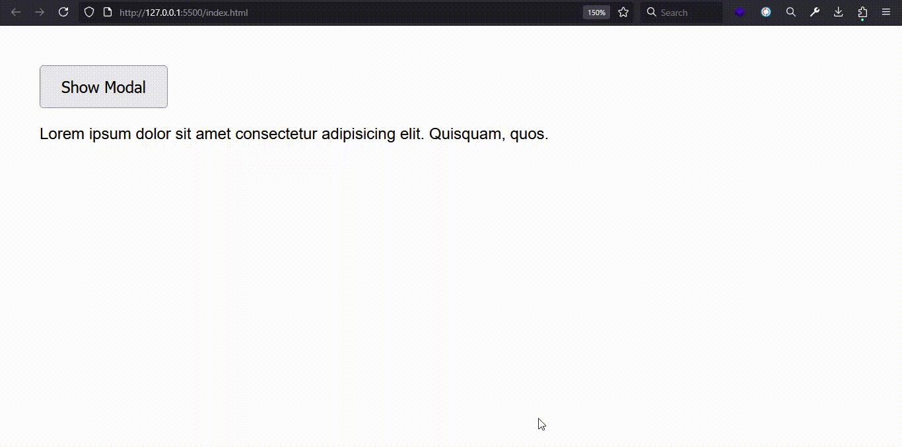
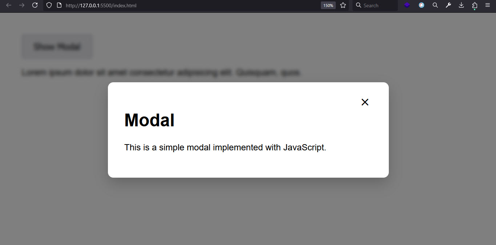

# JavaScript Modal Project

This is a simple JavaScript project that shows how to create and toggle a **modal popup** using Vanilla JavaScript.

## 🚀 Features

- Open and close modal on button click
- Close modal by clicking the backdrop
- Close modal using ESC key
- Styled with pure CSS and responsive design
- No external libraries required

## 📁 Project Structure
modal-project/
│
- index.html
- style.css
- app.js
- README.md

## 🚀 Live Demo

## 🧠 Concepts Used

- DOM manipulation with `querySelector`, `classList`
- `addEventListener` for interactivity
- CSS transitions and layout
- Accessibility with keyboard support

## 🖼️ Preview

---

### 👨‍💻 Author  
Made with ❤️ by [Sajjad Hosseinzadeh](https://github.com/sajjad7181)

